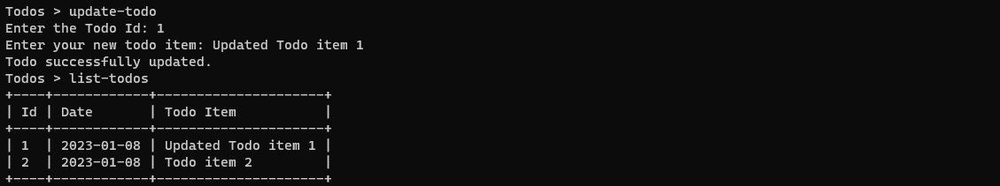

# TODO CLI

A Todo application that runs in the terminal. 
Created with Python 3.10.5, click_shell and prettytable.

## Screenshots

### Intro prompt

### Help menu

### Create Todo

### Update Todo

### Delete Todo

